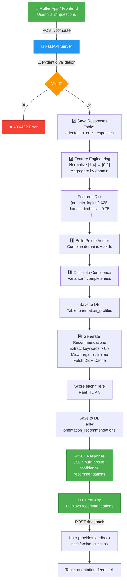

# 🔌 PROA API Specification (OpenAPI 3.0)

```yaml
openapi: 3.0.0

info:
  title: PROA - Platform d'Orientation Académique
  description: |
    Service de recommandation d'orientation pour étudiants.
    Pipeline complet : Quiz → Features → Profile → Recommendations
  version: 1.0.0
  contact:
    name: Backend Team
    email: backend@universearch.com

servers:
  - url: http://localhost:8000
    description: Development
  - url: https://universearch-proa-service.onrender.com
    description: Production

tags:
  - name: Quiz
    description: Charger les questions du quiz
  - name: Orientation
    description: Calculer profil et recommandations
  - name: History
    description: Historique orientation utilisateur
  - name: Feedback
    description: Retour utilisateur
  - name: Health
    description: Health check

paths:
  
  # ========================================
  # HEALTH CHECK
  # ========================================
  /health:
    get:
      tags:
        - Health
      summary: Vérifier que le service est actif
      operationId: healthCheck
      responses:
        '200':
          description: Service OK
          content:
            application/json:
              schema:
                type: object
                properties:
                  status:
                    type: string
                    example: ok
                  timestamp:
                    type: string
                    format: date-time
              examples:
                success:
                  value:
                    status: ok
                    timestamp: "2024-03-29T12:00:00Z"

  # ========================================
  # QUIZ ENDPOINTS
  # ========================================
  /orientation/questions:
    get:
      tags:
        - Quiz
      summary: Récupère les questions du quiz d'orientation
      operationId: getQuizQuestions
      parameters:
        - name: language
          in: query
          description: Langue des questions (fr, en, sw)
          schema:
            type: string
            enum: [fr, en, sw]
            default: fr
        - name: mode
          in: query
          description: Mode quiz (full = 24 questions, quick = 10 questions)
          schema:
            type: string
            enum: [full, quick]
            default: full
      responses:
        '200':
          description: Questions chargées avec succès
          content:
            application/json:
              schema:
                type: object
                properties:
                  quiz_id:
                    type: string
                    example: orientation_2024_v1.0
                  total_questions:
                    type: integer
                    example: 24
                  language:
                    type: string
                    example: fr
                  questions:
                    type: array
                    items:
                      type: object
                      properties:
                        id:
                          type: string
                          example: q1
                        domain:
                          type: string
                          example: logic
                        text:
                          type: string
                          example: J'aime résoudre des problèmes logiques
                        category:
                          type: string
                          example: Logical reasoning
                        scale_description:
                          type: object
                          properties:
                            1:
                              type: string
                              example: Strongly disagree
                            2:
                              type: string
                              example: Disagree
                            3:
                              type: string
                              example: Agree
                            4:
                              type: string
                              example: Strongly agree
                  instructions:
                    type: string
                    example: Rate each question 1-4
        '404':
          description: Aucune question trouvée
          content:
            application/json:
              schema:
                $ref: '#/components/schemas/ErrorResponse'
        '500':
          description: Erreur serveur
          content:
            application/json:
              schema:
                $ref: '#/components/schemas/ErrorResponse'

  # ========================================
  # MAIN COMPUTE ENDPOINT
  # ========================================
  /orientation/compute:
    post:
      tags:
        - Orientation
      summary: Calcule le profil d'orientation complet
      operationId: computeOrientation
      description: |
        Endpoint principal pour calculer profil + recommandations.
        
        Pipeline:
        1. Valide les réponses
        2. Save réponses brutes en DB
        3. Construit features (réponses → domaines/compétences)
        4. Calcule profil vectoriel
        5. Estime confiance
        6. Génère recommandations (top 5)
        7. Persiste en DB
        
        Response time: ~700ms (includes DB writes + API calls)
      requestBody:
        required: true
        content:
          application/json:
            schema:
              $ref: '#/components/schemas/QuizSubmission'
            examples:
              bachelor:
                value:
                  user_id: "student@university.ac.cd"
                  quiz_version: "1.0"
                  orientation_type: "field"
                  responses:
                    q1: 3
                    q2: 4
                    q3: 2
                    q4: 3
                    q5: 4
                    q6: 3
                    q7: 2
                    q8: 3
                    q9: 4
                    q10: 3
                    q11: 2
                    q12: 3
                    q13: 4
                    q14: 3
                    q15: 2
                    q16: 3
                    q17: 4
                    q18: 3
                    q19: 2
                    q20: 3
                    q21: 4
                    q22: 3
                    q23: 2
                    q24: 3
      responses:
        '201':
          description: Profil créé et recommandations générées
          content:
            application/json:
              schema:
                type: object
                properties:
                  status:
                    type: string
                    example: success
                  user_id:
                    type: string
                    example: student@university.ac.cd
                  profile:
                    type: array
                    items:
                      type: number
                    description: Vecteur normalisé 0-1
                    example: [0.625, 0.75, 0.50, 0.30, 0.70, 0.45, 0.60, 0.55]
                  confidence:
                    type: number
                    format: double
                    minimum: 0
                    maximum: 1
                    example: 0.841
                  confidence_interpretation:
                    type: string
                    enum: [very_low, low, moderate, high, very_high]
                    example: high
                  recommended_fields:
                    type: array
                    items:
                      $ref: '#/components/schemas/Recommendation'
                    maxItems: 5
                  debug_info:
                    type: object
                    properties:
                      features_extracted:
                        type: integer
                        example: 28
                      non_zero_features:
                        type: integer
                        example: 16
                      variance_based_confidence:
                        type: number
                        example: 0.982
                      completeness_ratio:
                        type: number
                        example: 0.857
                      processing_time_ms:
                        type: integer
                        example: 742
        '400':
          description: Bad Request (validation error)
          content:
            application/json:
              schema:
                $ref: '#/components/schemas/ErrorResponse'
              examples:
                empty_responses:
                  value:
                    status: error
                    detail: "Responses cannot be empty"
                    error_code: 400
                invalid_range:
                  value:
                    status: error
                    detail: "Response value for q1 must be between 1 and 4, got 5"
                    error_code: 400
        '422':
          description: Unprocessable Entity (semantic error)
          content:
            application/json:
              schema:
                $ref: '#/components/schemas/ErrorResponse'
        '500':
          description: Internal Server Error
          content:
            application/json:
              schema:
                $ref: '#/components/schemas/ErrorResponse'

  # ========================================
  # LIGHTWEIGHT SCORE ENDPOINT
  # ========================================
  /orientation/score-only:
    post:
      tags:
        - Orientation
      summary: Calcule UNIQUEMENT le score (sans recommandations)
      operationId: computeOrientationScoreOnly
      description: |
        Version légère pour PORA ou analyses rapides.
        N'inclut pas les recommandations.
        
        Response time: ~50ms (no DB write, no complex calculations)
      requestBody:
        required: true
        content:
          application/json:
            schema:
              $ref: '#/components/schemas/QuizSubmission'
      responses:
        '200':
          description: Score calculé
          content:
            application/json:
              schema:
                type: object
                properties:
                  user_id:
                    type: string
                  score:
                    type: number
                    minimum: 0
                    maximum: 1
                  timestamp:
                    type: string
                    format: date-time
                example:
                  user_id: "student@university.ac.cd"
                  score: 0.658
                  timestamp: "2024-03-29T12:00:00Z"
        '400':
          description: Bad Request
          content:
            application/json:
              schema:
                $ref: '#/components/schemas/ErrorResponse'
        '500':
          description: Internal Server Error
          content:
            application/json:
              schema:
                $ref: '#/components/schemas/ErrorResponse'

  # ========================================
  # HISTORY ENDPOINT
  # ========================================
  /orientation/history/{user_id}:
    get:
      tags:
        - History
      summary: Récupère l'historique d'orientation d'un utilisateur
      operationId: getOrientationHistory
      parameters:
        - name: user_id
          in: path
          required: true
          description: ID utilisateur
          schema:
            type: string
          example: student@university.ac.cd
        - name: limit
          in: query
          description: Nombre maximum d'entrées
          schema:
            type: integer
            minimum: 1
            maximum: 100
            default: 10
      responses:
        '200':
          description: Historique récupéré
          content:
            application/json:
              schema:
                type: object
                properties:
                  user_id:
                    type: string
                  count:
                    type: integer
                  history:
                    type: array
                    items:
                      type: object
                      properties:
                        timestamp:
                          type: string
                          format: date-time
                        quiz_version:
                          type: string
                        confidence:
                          type: number
                        top_match:
                          type: string
                        score:
                          type: number
                example:
                  user_id: "student@university.ac.cd"
                  count: 3
                  history:
                    - timestamp: "2024-03-28T14:00:00Z"
                      quiz_version: "1.0"
                      confidence: 0.84
                      top_match: "Informatique"
                      score: 0.85
                    - timestamp: "2024-03-27T10:30:00Z"
                      quiz_version: "1.0"
                      confidence: 0.76
                      top_match: "Génie Civil"
                      score: 0.72
        '404':
          description: User not found
          content:
            application/json:
              schema:
                $ref: '#/components/schemas/ErrorResponse'
        '500':
          description: Internal Server Error
          content:
            application/json:
              schema:
                $ref: '#/components/schemas/ErrorResponse'

  # ========================================
  # FEEDBACK ENDPOINT
  # ========================================
  /orientation/feedback:
    post:
      tags:
        - Feedback
      summary: Sauvegarde le feedback utilisateur
      operationId: submitOrientationFeedback
      description: |
        Utilisé pour mesurer la précision des recommandations
        et améliorer le modèle via retours utilisateur.
      requestBody:
        required: true
        content:
          application/json:
            schema:
              $ref: '#/components/schemas/OrientationFeedback'
            example:
              user_id: "student@university.ac.cd"
              satisfaction: 4
              changed_orientation: true
              success: true
      responses:
        '200':
          description: Feedback sauvegardé
          content:
            application/json:
              schema:
                type: object
                properties:
                  status:
                    type: string
                    example: feedback_saved
                  user_id:
                    type: string
        '400':
          description: Bad Request
          content:
            application/json:
              schema:
                $ref: '#/components/schemas/ErrorResponse'
        '500':
          description: Internal Server Error
          content:
            application/json:
              schema:
                $ref: '#/components/schemas/ErrorResponse'

  # ========================================
  # PROPOSED: GET QUIZ BY USER TYPE
  # ========================================
  /orientation/quiz/{user_type}:
    get:
      tags:
        - Quiz
      summary: '[PROPOSED] Charger quiz adapté au type utilisateur'
      operationId: getQuizByUserType
      deprecated: false
      parameters:
        - name: user_type
          in: path
          required: true
          description: Type utilisateur (bachelier, etudiant, parent)
          schema:
            type: string
            enum: [bachelier, etudiant, parent]
      responses:
        '200':
          description: Quiz chargé
          content:
            application/json:
              schema:
                type: object
                properties:
                  quiz_id:
                    type: string
                  user_type:
                    type: string
                  total_questions:
                    type: integer
                  questions:
                    type: array
                    items:
                      type: object
        '404':
          description: Quiz not found for user_type
          content:
            application/json:
              schema:
                $ref: '#/components/schemas/ErrorResponse'

# ========================================
# COMPONENTS
# ========================================
components:
  schemas:

    # QuizSubmission - Main input request
    QuizSubmission:
      type: object
      required:
        - user_id
        - responses
      properties:
        user_id:
          type: string
          description: Unique user identifier (email or UUID)
          example: student@university.ac.cd
        quiz_version:
          type: string
          description: Version du quiz (format X.Y)
          example: "1.0"
        orientation_type:
          type: string
          description: Type d'orientation (filière ou institution)
          enum: [field, institution]
          default: field
        responses:
          type: object
          description: Réponses au quiz (question_id → score 1-4)
          additionalProperties:
            type: integer
            minimum: 1
            maximum: 4
          example:
            q1: 3
            q2: 4
            q3: 2

    # Recommendation - Single field/institution recommendation
    Recommendation:
      type: object
      properties:
        id:
          type: string
          example: filiere_001
        name:
          type: string
          example: Informatique
        description:
          type: string
          example: Programme technique avec forte employabilité
        score:
          type: number
          format: double
          minimum: 0
          maximum: 1
          example: 0.92
        confidence:
          type: number
          format: double
          minimum: 0
          maximum: 1
          example: 0.84
        rank:
          type: integer
          example: 1
        match_factors:
          type: array
          items:
            type: string
          example: [technical, logic, analysis]
        why:
          type: string
          example: "Forte correspondance avec vos compétences en logique et technique"

    # OrientationFeedback - User feedback
    OrientationFeedback:
      type: object
      required:
        - user_id
        - satisfaction
      properties:
        user_id:
          type: string
          example: student@university.ac.cd
        satisfaction:
          type: integer
          minimum: 1
          maximum: 5
          description: Score de satisfaction (1=très insatisfait, 5=très satisfait)
          example: 4
        changed_orientation:
          type: boolean
          description: L'utilisateur a-t-il changé d'avis sur son orientation?
          example: true
        success:
          type: boolean
          nullable: true
          description: L'orientation recommandée a-t-elle été utile?
          example: true
        comment:
          type: string
          nullable: true
          description: Commentaire optionnel
          example: "La recommandation était très pertinente"

    # ErrorResponse - Standard error response
    ErrorResponse:
      type: object
      required:
        - status
        - detail
      properties:
        status:
          type: string
          enum: [error]
          example: error
        detail:
          type: string
          description: Message d'erreur détaillé
          example: "Responses cannot be empty"
        error_code:
          type: integer
          example: 400
        timestamp:
          type: string
          format: date-time
        request_id:
          type: string
          description: ID unique pour tracking (logs)
          example: req_abc123def456

# ========================================
# SECURITY
# ========================================
security:
  - ApiKeyAuth: []

securitySchemes:
  ApiKeyAuth:
    type: apiKey
    in: header
    name: X-API-Key
    description: API Key pour authentication (optionnel en dev)

# ========================================
# RATE LIMITING
# ========================================
info:
  x-rateLimit:
    requests: 100
    window: 60
    description: "100 requests per 60 seconds per API key"

# ========================================
# EXAMPLES
# ========================================
x-logo:
  url: "https://universearch.app/logo.png"
  altText: "Universearch Logo"
```

---

## 📊 Mermaid Diagram: Complete Flow



---

## 🚀 Usage Examples

### Example 1: Complete Orientation (POST /compute)

```bash
curl -X POST http://localhost:8000/orientation/compute \
  -H "Content-Type: application/json" \
  -d '{
    "user_id": "student@university.ac.cd",
    "quiz_version": "1.0",
    "orientation_type": "field",
    "responses": {
      "q1": 3, "q2": 4, "q3": 2, "q4": 3,
      "q5": 4, "q6": 3, "q7": 2, "q8": 3,
      "q9": 4, "q10": 3, "q11": 2, "q12": 3,
      "q13": 4, "q14": 3, "q15": 2, "q16": 3,
      "q17": 4, "q18": 3, "q19": 2, "q20": 3,
      "q21": 4, "q22": 3, "q23": 2, "q24": 3
    }
  }'
```

### Example 2: Load Quiz

```bash
curl -X GET "http://localhost:8000/orientation/questions?language=fr&mode=full"
```

### Example 3: Get History

```bash
curl -X GET "http://localhost:8000/orientation/history/student@university.ac.cd?limit=5"
```

### Example 4: Submit Feedback

```bash
curl -X POST http://localhost:8000/orientation/feedback \
  -H "Content-Type: application/json" \
  -d '{
    "user_id": "student@university.ac.cd",
    "satisfaction": 4,
    "changed_orientation": true,
    "success": true,
    "comment": "Très utile!"
  }'
```

---

**API Version**: 1.0.0  
**Last Updated**: 2024-03-29  
**Status**: Production Ready
